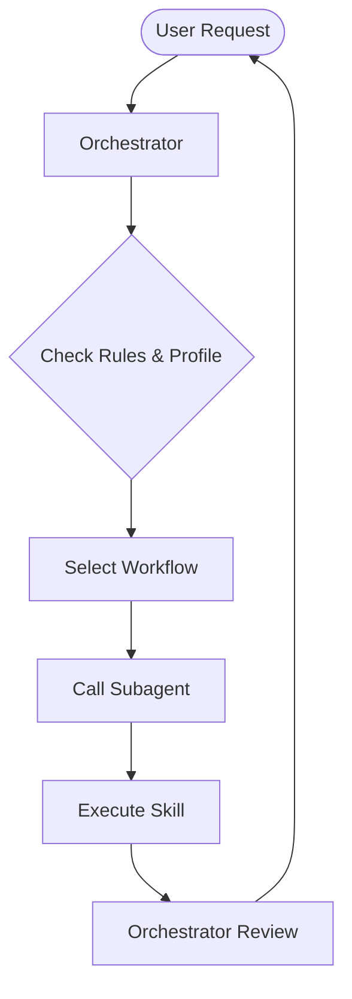

# Protocol: Agent Orchestration Logic

## Core Principle
Work is divided into **Orchestration** (Planning/Management) and **Execution** (Specialized Skills).

## 1. The Orchestrator (User-Facing Agent)
The primary agent that interacts with the user is the **Orchestrator**.
- **Role**: Understands user intent, chooses the right workflow, and manages the lifecycle of a task.
- **Rules Consultation**: Must strictly follow `.agent/rules/` and respect `user-profile.md`.
- **Delegation**: Does not perform specialized tasks directly if a Subagent exists for that purpose.

## 2. The Subagents (Specialists)
Found in `.agent/agents/`, these are agents defined by the `agent-template.md`.
- **Specialization**: Each Subagent is "married" to a specific `assigned_skill`.
- **Execution**: When called by the Orchestrator, the Subagent uses its skill to perform a specific part of the workflow.

## 3. Communication Pattern
1. **Request**: Orchestrator defines the task and passes relevant context (files, goals) to the Subagent.
2. **Action**: Subagent executes its `assigned_skill`.
3. **Response**: Subagent returns the output (e.g., refactored code, edited text) to the Orchestrator.
4. **Audit**: Orchestrator performs a final review of the Subagent's work before presenting it to the user.

## 4. Operational Loop

