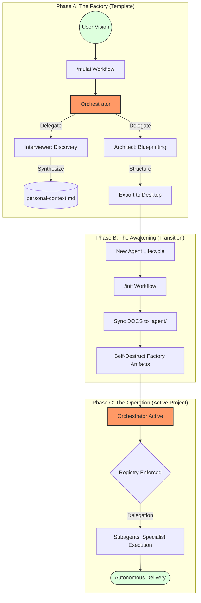

# Antigravity: The Project Factory System

> **Transforming raw visions into autonomous project structures.**

Antigravity is an agentic project generation engine. It doesn't just scaffold code; it births a living workspace equipped with a specialized team of subagents, rules, and workflows tailored to your specific context.

## 🌀 The Antigravity Lifecycle

## 🛠 Operational Protocols

This system is managed exclusively by the **Orchestrator**.

### 1. In this Template (/mulai)
Run the `/mulai` command to start the Project Factory. The Orchestrator will lead you through a discovery session to define your project's identity and technical needs.

### 2. In the New Project (/init)
When you first open a generated project, run the `/init` command. This will:
- Activate all rules, workflows, and subagents.
- Mirror the knowledge-base and skills.
- Clean up temporary factory files (`DOCS/`, `init.md`).

## 👥 Agent & Skill Registry

The Orchestrator delegates specialized tasks according to this registry:

| Agent | Primary Skill(s) | Role & Responsibility |
| :--- | :--- | :--- |
| **Interviewer** | `brainstorming-pro`, `fact-search` | Discovery, Vision clarity, and Context synthesis. |
| **Architect** | `architecture-visualizer` | Structural design, tech-stack selection, blueprints. |
| **QA Auditor** | `context-audit`, `diff-analyzer` | Validation, integrity checks, and anomaly detection. |
| **Output Editor** | `writing-style`, `linguistic-bridge` | Style harmonization and high-quality messaging. |

---
*Powered by Antigravity Agentic Framework.*
- **`knowledge-base/`**: A central knowledge hub for storing reference documents (PDF, DOCX, TXT, MD) as context for project creation.

## Quick Start
1. **Provide Context**: Place your project's reference documents into the `knowledge-base/` folder.
2. **Run the Factory**: Use the slash command `/mulai` to trigger the discovery and interview process. The project will be built locally in the `exports/` directory.

## Workflow
The system follows a **Cascading Documentation** approach:
`Knowledge Base` -> `User Profile` -> `Rules` -> `Workflows` -> `Agents Persona`.

---
*Created with Mechanical Grace by Antigravity.*
